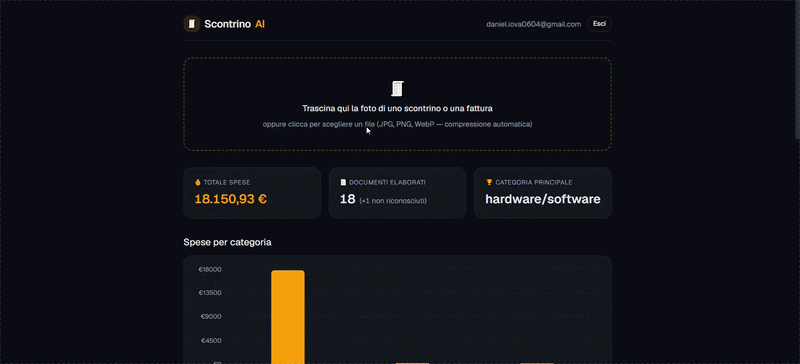
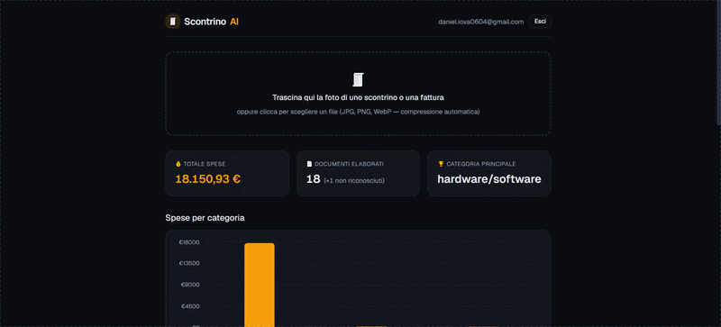

# 🧾 ScontrinoAI

> Da foto di scontrino a dati strutturati: pipeline di estrazione con AI vision, validazione automatica e retry intelligente.



**🔗 Demo live:** [scontrinoai.vercel.app](https://scontrinoai.vercel.app) · login con magic link, nessuna password

**⏱ Costruito in ~4 ore** — breakdown completo in [HOURS.md](./HOURS.md)

---

## Cosa fa

Carichi la foto di uno scontrino o di una fattura (anche stropicciata, sbiadita, fotografata storta). La pipeline la manda a un modello vision, estrae i dati in JSON strutturato — esercente, data, totale, IVA, categoria di spesa, singole voci — li **valida contro uno schema**, e se il risultato non regge **riprova dando al modello il feedback dell'errore**. I dati finiscono in una dashboard con statistiche per categoria, dettaglio per documento ed export CSV.



## Architettura della pipeline

```
[Foto] → compressione client-side → Supabase Storage
   ↓
POST /api/extract
   ↓
┌──────────────────────────────────────────────────┐
│  1. Vision LLM (Gemini) → JSON grezzo            │
│  2. Validazione Zod:                             │
│     · forma dei dati (tipi, formati, enum)       │
│     · coerenza aritmetica: Σ voci = totale       │
│       (o totale − IVA, per le fatture)           │
│  3. KO → retry con gli errori Zod reiniettati    │
│     nel prompt (max 3 tentativi)                 │
│  4. Guardrail: se l'immagine non è un documento  │
│     di spesa → fail pulito, zero retry sprecati  │
└──────────────────────────────────────────────────┘
   ↓
Postgres (con tracciamento: tentativi, error log,
raw output, modello usato, confidence autovalutata)
   ↓
Dashboard: statistiche, grafico, dettaglio, export CSV
```

Ogni estrazione è **completamente tracciata**: nella pagina di dettaglio di ogni documento, la sezione "Dietro le quinte" mostra l'output grezzo del modello e il log dei tentativi falliti con i relativi errori di validazione.

## Stack

| Layer | Tecnologia |
|---|---|
| Frontend + API | Next.js 16 (App Router, TypeScript, Turbopack) |
| Database, Auth, Storage | Supabase — Postgres con Row Level Security, magic link, bucket privato con signed URL |
| AI Vision | Gemini 2.5 Flash, dietro un'interfaccia astratta (`VisionProvider`): **cambiare modello = cambiare un import** |
| Validazione | Zod — schema unico che fa da fonte di verità per validazione runtime, tipi TypeScript e descrizione dello schema nel prompt |
| UI | Tailwind CSS v4 + shadcn/ui, tema dark con design token centralizzati |
| Deploy | Vercel, con preview automatica per ogni PR |

## Le decisioni che contano

**Retry con feedback, non retry cieco.** Quando la validazione fallisce, gli errori Zod (strutturati, campo per campo) vengono reiniettati nel prompt: il modello sa *cosa* correggere e *perché*. Nei test, questo ha risolto al secondo tentativo casi che un retry cieco avrebbe ripetuto identici.

**Il check aritmetico come test di verità.** Lo schema non valida solo la forma: verifica che la somma delle voci corrisponda al totale (o al totale al netto IVA, per le fatture — dove le voci sono tipicamente imponibili). È il check che ha scovato, in collaudo, il modello che "aggiustava" gli importi delle fatture per far tornare i conti.

**Anti-allucinazione graduata.** Su documenti illeggibili il modello tendeva a inventare voci plausibili che sommavano al totale. Il prompt ora impone: voci completamente illeggibili → elenco vuoto e confidence bassa; parzialmente leggibili → estrai solo ciò che leggi con certezza. Meglio un dato incompleto di un dato falso.

**Guardrail di dominio.** Un'immagine che non è un documento di spesa (un selfie, una stanza) produce un fallimento pulito e immediato — niente retry (l'immagine non cambierà), niente record spazzatura a database.

**Sicurezza by default.** Row Level Security su ogni tabella, bucket Storage privato con path segregati per utente e signed URL a scadenza, service key mai usata nel flusso applicativo, compressione client-side che limita banda e costi di inferenza.

## Collaudo

Testato su casi progettati per rompere la pipeline:

| Caso | Esito |
|---|---|
| Scontrino supermercato con doppia aliquota IVA | ✅ estratto al 1° tentativo, aliquota correttamente `null` |
| Scontrino da bar stropicciato, storto, in penombra | ✅ estratto al 1° tentativo |
| Scontrino quasi illeggibile | ✅ risposta onesta: voci vuote/parziali + confidence `low` |
| Fattura A4 con voci IVA esclusa | ✅ importi come stampati, riconosciuta dal check aritmetico esteso |
| Foto che non è un documento | ✅ `failed` pulito al 1° tentativo, nessun dato inventato |

## Eseguire in locale

```bash
git clone https://github.com/daniiovaaa/scontrinoai.git
cd scontrinoai
npm install
cp .env.example .env.local   # e compila le variabili
npm run dev
```

Variabili richieste in `.env.local`:

```
NEXT_PUBLIC_SUPABASE_URL=
NEXT_PUBLIC_SUPABASE_ANON_KEY=
SUPABASE_SERVICE_ROLE_KEY=
GOOGLE_API_KEY=
```

Serve un progetto Supabase con lo schema in [`docs/schema.sql`](docs/schema.sql) e un bucket Storage privato `receipts`.

## Next steps (fuori scope, deliberatamente)

- **Suite di regression test per il prompt**: le immagini di collaudo + output attesi, rilanciate a ogni modifica del prompt — ciò che trasforma il prompt engineering da artigianato a ingegneria
- **Structured output nativo** (`responseSchema` di Gemini) come garanzia di forma a livello API, con Zod a presidiare la semantica
- **Few-shot examples nel prompt** per ridurre la varianza sui documenti borderline
- Eliminazione multipla dalla tabella con selezione e soft-delete
- Tema chiaro con toggle (i design token sono già centralizzati: il grosso è fatto)
- SMTP dedicato (Resend) per il magic link, multi-tenancy, coda di elaborazione batch

---

*Progetto costruito come MVP dimostrativo. Workflow: feature branch → PR → review → merge, nessun commit diretto su main — la [lista delle PR](https://github.com/daniiovaaa/scontrinoai/pulls?q=is%3Apr+is%3Amerged) racconta la storia dello sviluppo.*